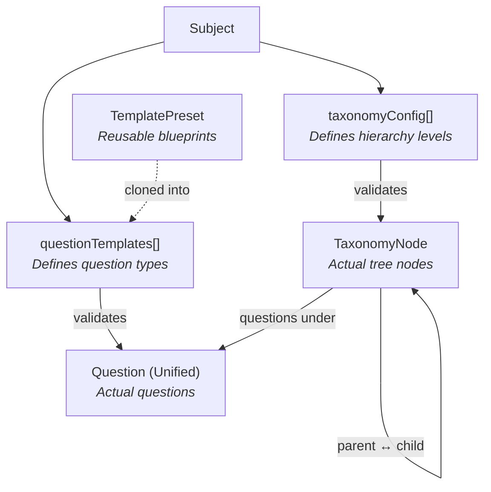

# Database Architecture — Question Bank Admin Panel

> Last updated: Feb 2024 | Models directory: `backend/models/`

## Quick Overview

The system uses **MongoDB** (via Mongoose) with two database connections:

| Connection | Variable | Purpose |
|---|---|---|
| `userDb` | `MONGODB_URI_USER` | Employee/auth data |
| `academicDb` | `MONGODB_URI_ACADEMIC` | All academic content (subjects, questions, taxonomy) |

---

## Model Map

```
backend/models/
├── schemas/
│   └── fieldDefinition.schema.js    ← Shared sub-schema (not a model)
│
├── ── CORE DYNAMIC MODELS ──────────
├── subject.model.js                  ← Subject + taxonomyConfig + questionTemplates
├── taxonomyNode.model.js             ← Universal tree (chapters, topics, categories, etc.)
├── question.unified.model.js         ← Universal question store (CQ, MCQ, grammar, etc.)
├── templatePreset.model.js           ← Global reusable question type blueprints
│
├── ── LEGACY MODELS (migration pending) ──
├── chapter.model.js                  ← Old: Subject → Chapter hierarchy
├── topic.model.js                    ← Old: Chapter → Topic hierarchy
├── cq.model.js                       ← Old: Creative Questions (hardcoded schema)
├── b2.question.model.js              ← Old: B2 grammar questions (hardcoded schema)
├── formula.model.js                  ← Formulas (standalone, still used)
│
├── ── STANDALONE ENTITIES ──────────
├── writer.model.js                   ← Writers/Poets (referenced by content)
├── type.model.js                     ← Question types (MCQ, CQ, etc.)
│
├── ── AI & EMBEDDINGS ──────────────
├── question.embedding.model.js       ← Vector embeddings for question search
├── subject.embedding.model.js        ← Vector embeddings for subject search
│
├── ── USER & SYSTEM ────────────────
├── employee.model.js                 ← Employee/admin accounts
├── employee.*.model.js               ← Employee documents (NID, passport, etc.)
└── message.model.js                  ← System messages
```

---

## Core Architecture: How It Works

### The Problem We Solved

Previously, every subject variation had its own Mongoose model — Uccharon, Banan, Goddo, Poddo, Sharangsho, etc. This led to **47 model files** and made adding new subjects require new code.

### The Solution: Schema-as-Data

Instead of hardcoding schemas in code, the **structure itself is stored as data** in the database.



---

## Model Details

### 1. Subject (`subject.model.js`)

The central entity. Every subject has:

| Field | Type | Purpose |
|---|---|---|
| `name` | `{ en, bn }` | Bilingual name |
| `subjectCode` | `Number` | NCTB subject code |
| `level` | `SSC \| HSC` | Academic level |
| `group` | `SCIENCE \| HUMANITIES \| COMMERCE` | Academic group |
| `chapters` | `[ObjectId]` | **Legacy** — old chapter refs (migration pending) |
| `taxonomyConfig` | `[TaxonomyLevel]` | **New** — defines the hierarchy structure |
| `questionTemplates` | `[QuestionTemplate]` | **New** — defines available question types |

#### `taxonomyConfig[]` — Defines the hierarchy

Each entry describes one level in the subject's organizational tree:

```javascript
// Example: Physics subject
taxonomyConfig: [
  { key: "chapter", label: { en: "Chapter", bn: "অধ্যায়" }, depth: 0, parentLevelKey: null,  canHaveQuestions: false },
  { key: "topic",   label: { en: "Topic",   bn: "পাঠ" },    depth: 1, parentLevelKey: "chapter", canHaveQuestions: true },
]

// Example: Bangla 2nd Paper
taxonomyConfig: [
  { key: "section",  label: { en: "Section",  bn: "বিভাগ" },   depth: 0, parentLevelKey: null },
  { key: "category", label: { en: "Category", bn: "শ্রেণি" },  depth: 1, parentLevelKey: "section",
    subtypes: [ { key: "uccharon" }, { key: "banan" }, { key: "sharangsho" }, ... ],
    canHaveQuestions: true },
]
```

#### `questionTemplates[]` — Defines available question types

Each entry is a question template (optionally cloned from a `TemplatePreset`):

```javascript
questionTemplates: [
  {
    templateKey: "mcq",
    presetKey: "mcq",           // Cloned from global preset
    label: { en: "MCQ", bn: "বহুনির্বাচনী" },
    fields: [ ... ],            // Field definitions (see fieldDefinition.schema.js)
    allowedNodeTypes: ["topic"], // Can only add MCQs under "topic" nodes
  },
]
```

---

### 2. TaxonomyNode (`taxonomyNode.model.js`)

A universal tree node. **Replaces** the old Chapter, Topic, B1, B2, Goddo, Poddo, Uccharon, Banan, and 20+ other models.

| Field | Type | Purpose |
|---|---|---|
| `subjectId` | `ObjectId → Subject` | Which subject this belongs to |
| `parentId` | `ObjectId → TaxonomyNode` | Parent node (`null` = root) |
| `nodeType` | `String` | Matches `taxonomyConfig[].key` (e.g., `"chapter"`, `"topic"`) |
| `subtype` | `String` | Optional (e.g., `"goddo"` vs `"poddo"` within `"content"` type) |
| `depth` | `Number` | Tree depth (0 = root) |
| `order` | `Number` | Display order among siblings |
| `name` | `{ en, bn }` | Bilingual name |
| `data` | `Mixed` | Type-specific content, validated against `taxonomyConfig[].dataSchema` |
| `ancestors` | `[ObjectId]` | Materialized path for efficient tree queries |

**Key queries:**
```javascript
// Get root nodes for a subject
TaxonomyNode.find({ subjectId, parentId: null })

// Get children of a node
TaxonomyNode.find({ parentId: nodeId }).sort({ order: 1 })

// Get all descendants of a node
TaxonomyNode.find({ ancestors: nodeId })
```

---

### 3. UnifiedQuestion (`question.unified.model.js`)

Universal question store. **Replaces** the old CQ, MCQ, and B2Question models.

| Field | Type | Purpose |
|---|---|---|
| `subjectId` | `ObjectId → Subject` | Which subject |
| `nodeId` | `ObjectId → TaxonomyNode` | Which node the question is attached to |
| `templateKey` | `String` | Matches `subject.questionTemplates[].templateKey` |
| `status` | `PUBLISHED \| DRAFT \| UNDER_REVIEW` | Question status |
| `source` | `{ sourceType, value, year, examType }` | Board/exam source |
| `marks` | `Number` | Total marks |
| `difficulty` | `EASY \| MEDIUM \| HARD` | Difficulty level |
| `data` | `Mixed` | Template-specific question content |

The `data` field is **validated at the application layer** (not by Mongoose) using `validateDynamicData.util.js` against the template's `fields[]` definitions.

---

### 4. TemplatePreset (`templatePreset.model.js`)

Global reusable question type blueprints. These are **starter templates** that get cloned into a subject's `questionTemplates[]`.

| Family | Preset Key | Covers |
|---|---|---|
| `STRUCTURED` | `cq` | Creative Questions (stem + parts a/b/c/d) |
| `CHOICE` | `mcq` | Multiple Choice Questions |
| `GRAMMAR` | `grammar_rule` | Uccharon, Banan, ShobdoSreni, etc. |
| `WRITTEN` | `written_composition` | Probondho Rochona, Dinolipi, PotroLikhon |
| `TRANSLATION` | `translation` | Onubad, PoribhashikShobdo |

---

### 5. FieldDefinition Schema (`schemas/fieldDefinition.schema.js`)

Not a model — a reusable sub-schema that defines a single dynamic field. Used in `TemplatePreset.fields`, `Subject.questionTemplates[].fields`, and `Subject.taxonomyConfig[].dataSchema`.

**Supported field types:**

| Type | Renders As |
|---|---|
| `TEXT` | Single-line text input |
| `RICH_TEXT` | Multi-line / LaTeX editor |
| `BILINGUAL_TEXT` | Side-by-side `{ en, bn }` inputs |
| `NUMBER` | Numeric input |
| `SELECT` | Single dropdown |
| `MULTI_SELECT` | Multi-tag select |
| `IMAGE_ARRAY` | Image upload grid |
| `CONTENT_BLOCKS` | Ordered bilingual text + image blocks |
| `REFERENCE` | Entity search dropdown (single) |
| `REFERENCE_ARRAY` | Entity search (multiple) |
| `NESTED_GROUP` | Fixed group of child fields |
| `CQ_GROUP` | Repeatable group (add/remove instances) |
| `MCQ_OPTIONS` | MCQ options with correct answer toggle |
| `BOOLEAN` | Checkbox / toggle |
| `KEY_VALUE_ARRAY` | Dynamic key-value pairs |

---

## API Routes

| Method | Route | Controller | Purpose |
|---|---|---|---|
| `GET` | `/api/v1/taxonomy/subject/:subjectId` | `taxonomyNode` | Get root/child nodes |
| `GET` | `/api/v1/taxonomy/:id` | `taxonomyNode` | Get node + children |
| `GET` | `/api/v1/taxonomy/:id/breadcrumbs` | `taxonomyNode` | Get ancestor path |
| `POST` | `/api/v1/taxonomy` | `taxonomyNode` | Create a node |
| `PUT` | `/api/v1/taxonomy/:id` | `taxonomyNode` | Update a node |
| `DELETE` | `/api/v1/taxonomy/:id` | `taxonomyNode` | Delete node + descendants |
| `POST` | `/api/v1/unified-questions` | `question.unified` | Create a question |
| `GET` | `/api/v1/unified-questions/:id` | `question.unified` | Get single question |
| `GET` | `/api/v1/unified-questions/node/:nodeId` | `question.unified` | Get questions by node |
| `GET` | `/api/v1/unified-questions/subject/:subjectId` | `question.unified` | Get questions by subject |
| `PUT` | `/api/v1/unified-questions/:id` | `question.unified` | Update a question |
| `DELETE` | `/api/v1/unified-questions/:id` | `question.unified` | Delete a question |
| `GET` | `/api/v1/template-presets` | `templatePreset` | List all presets |
| `GET` | `/api/v1/template-presets/:key` | `templatePreset` | Get preset by key |
| `POST` | `/api/v1/template-presets` | `templatePreset` | Create a preset |
| `PUT` | `/api/v1/template-presets/:id` | `templatePreset` | Update a preset |
| `DELETE` | `/api/v1/template-presets/:id` | `templatePreset` | Delete a preset |

---

## Legacy Models (Migration Pending)

These models are still in use by old controllers/services and will be removed once data is migrated to the new dynamic architecture:

| Model | Used By | Will Be Replaced By |
|---|---|---|
| `chapter.model.js` | `subject.service.js` | `TaxonomyNode` (nodeType: `"chapter"`) |
| `topic.model.js` | `subject.service.js` | `TaxonomyNode` (nodeType: `"topic"`) |
| `cq.model.js` | `question.service.js` | `UnifiedQuestion` (templateKey: `"cq"`) |
| `b2.question.model.js` | `b2.question.service.js` | `UnifiedQuestion` |

---

## Adding a New Subject (Zero Code Changes)

1. **Create the Subject** — set `name`, `level`, `group`
2. **Define `taxonomyConfig[]`** — specify hierarchy levels (e.g., chapter → topic)
3. **Clone template presets** — pick from `TemplatePreset` collection, customize labels/fields
4. **Create TaxonomyNodes** — add chapters, topics, categories
5. **Add questions** — use the dynamic form driven by the template

No new model files, no new controllers, no new React components needed.
